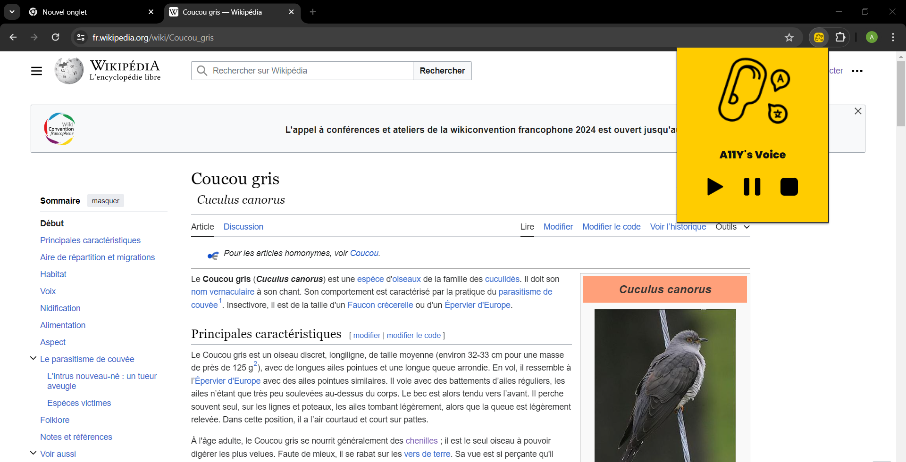

# A11Y'S VOICE PROJECT

## Description
Cette extension de navigateur vous permet dans une logique d'accessibilité visuelle de lire le texte d'une page web en le sélectionnant et en appuyant sur les touches Ctrl + M.

## Installation
1. Téléchargez les fichiers de l'extension à partir du dépôt GitHub.
2. Ouvrez votre navigateur Google Chrome et accédez à la page des extensions.
3. Activez le mode développeur si ce n'est pas déjà fait.
4. Cliquez sur "Charger l'extension non empaquetée" et sélectionnez le dossier contenant les fichiers de l'extension.
5. Cliquez sur la petite épingle et l'installation sera complêtée.

## Activation
Pour activer l'extension, suivez ces étapes :
1. Ouvrez une nouvelle fenêtre ou un nouvel onglet dans votre navigateur Google Chrome.
2. Sur n'importe quelle page web, sélectionner votre texte avec la souris et appuyez simultanément sur les touches Ctrl + M.
3. Le texte sera lu par le navigateur et vous pourrez contrôler (marche / pause / arrêt) par le biais du pop-up (icône en haut à droite).

## Fonctionnalités
- **Contrôle du Son :**L'extension permet de contrôler la lecture audio dans le navigateur. Vous pouvez :
  - Activer la lecture audio en appuyant sur **Ctrl + M**.
  - Mettre la lecture en pause en cliquant sur l'icône **double barre** sur le pop-up.
  - Reprendre la lecture en cliquant sur l'icône **triangle**.
  - Arrêter la lecture en cliquant sur l'icône **carré**.
- **Compatibilité :** Compatible avec Google Chrome
- **Légèreté :** Conçue pour une utilisation efficace des ressources et sans ralentissement notable du navigateur.

## Contributeurs
- [Adriane](https://github.com/Adrilabelle)
- [Aline](https://github.com/alinemaligorne)
- [Awen](https://github.com/awenBourdon)
